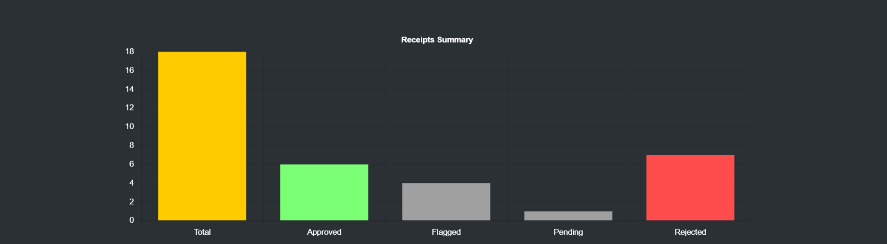
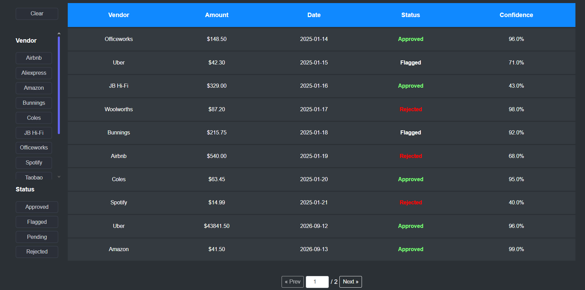
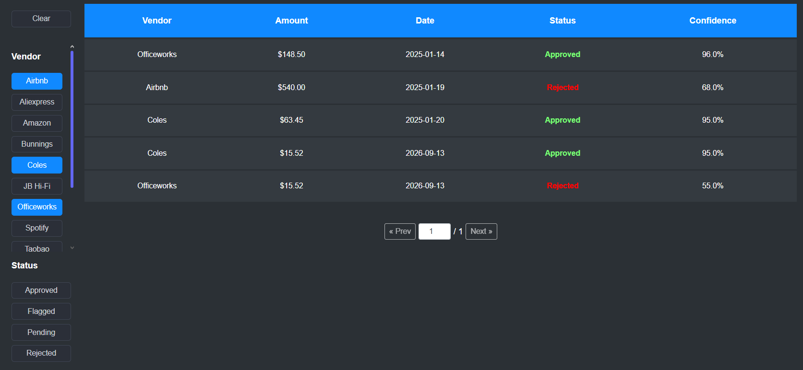
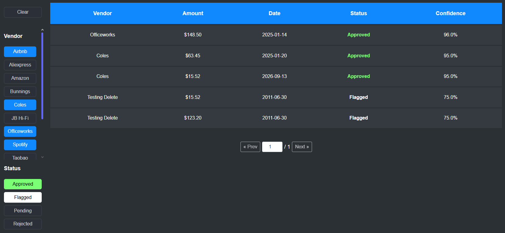
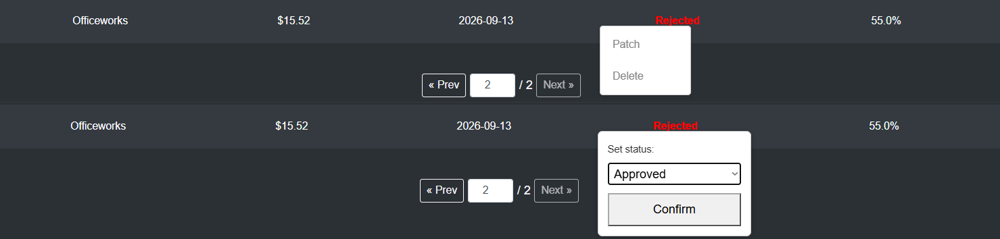

# Receipts Review App

A small internal tool for reviewing, filtering, sorting, and triaging scanned receipts (approve / flag / reject), with a summary chart of receipt statuses.

Summarize  chart

Receipt table with sorting, filter functions
## Technologies Used

**Backend**
- Python 3 / Flask
- Flask-SQLAlchemy (ORM) + SQLite (`receipts.db`)
- Flask-CORS

**Frontend**
- Jinja2 templates (server-rendered HTML, no frontend framework)
- Vanilla JavaScript (no build step, no bundler)
- Chart.js (via CDN) for the receipts summary bar chart

## How the Application Is Structured

```
.
├── app.py              # Flask app: routes, models, filtering/sorting/pagination logic
├── data.py             # Seed data for initial receipts (used by commented-out seeding block)
├── receipts.db          # SQLite database (created on first run)
├── templates/
│   └── app.html         # Main page template (table, filter bar, modals, chart canvas)
└── static/
    └── main.js           # All frontend behavior (see below)
    └── style.css         # Main page styling
```

**Backend (`app.py`)**
- Single `Receipt` model: `id`, `vendor`, `amount`, `status`, `record_date`, `confidence`.
- `apply_filters_and_sort()` is the shared query builder used by both the page route (`/home`) and the JSON API (`/receipts`) — it reads `status`, `vendor`, `sort`, `order`, `page`, and `per_page` from the query string, applies filters/sorting, and paginates.

- Routes:
  | Route | Method | Purpose |
  |---|---|---|
  | `/home` | GET | Renders the main page (server-side rendered table) |
  | `/vendors` | GET | Returns the distinct list of vendors, for the filter checkboxes |
  | `/receipts` | GET | JSON list of receipts (filtered/sorted/paginated) |
  | `/receipts/` | POST | Create a receipt |
  | `/receipts/<id>` | PATCH | Update a receipt's status |
  | `/receipts/<id>` | DELETE | Delete a receipt |
  | `/receipts/summary` | GET | Counts per status, used to draw the summary chart |

**Frontend (`static/main.js`)**
- Wrapped in a single IIFE (`(function () { 'use strict'; ... })();`) so none of its variables or helper functions leak into the global scope.

- Handles, in one file: column sorting (via URL query params), vendor/status filter checkboxes, pagination controls, a right-click context menu for approving/rejecting/deleting a receipt, restoring scroll position across page reloads, and drawing the Chart.js summary bar chart.

- State (current filters, sort, page) is kept entirely in the URL query string — every filter/sort/page action reloads the page with updated query params. This keeps state shareable/bookmarkable and avoids needing a frontend framework.

## Important Decisions

- **No frontend framework / build step.** Given the app's small surface area (one table, one chart, a few controls), plain JS + server-rendered templates were simpler to reason about and deploy than introducing a bundler.

- **URL query params as the single source of truth for table state.** Sort column/order, filters, and page number all live in the URL rather than client-side state. This means the "current view" is always a shareable link and survives a refresh with no extra code.

- **Input validation on write endpoints (`POST`/`PATCH`).** `amount` is explicitly coerced to `float` (accepting both numbers and numeric strings), `status` is checked against the `ReceiptStatus` enum, and `record_date` is parsed with a caught `ValueError`, so malformed input returns a `400` with a clear message instead of an uncaught `500`.

- **No authentication, and CORS is wide open (`origins: "*"`).** This app is intended to be run locally (`127.0.0.1`) for a demo/review, not deployed publicly.

- **`debug=True` in `app.run()`.** Intentionally left on for local development and convinient testing.

## Running the Application

**Prerequisites:** Python 3.9+ and `pip`.

1. **Install dependencies:**
   ```bash
   pip install flask flask-cors flask-sqlalchemy
   ```

2. **Create the database (first run only).**
   The seeding code is currently commented out at the bottom of `app.py`. Uncomment this block once to create the schema and load the sample data from `data.py`:
   ```python
   with app.app_context():
       db.create_all()

       if db.session.scalar(db.select(func.count()).select_from(Receipt)) == 0:
           for r in receipts:
               db.session.add(Receipt(
                   vendor=r.get("vendor"),
                   amount=r.get("amount"),
                   status=r.get("status", "Pending"),
                   record_date=datetime.strptime(r.get("record_date"), '%Y-%m-%d').date(),
                   confidence=r.get("confidence"),
               ))
           db.session.commit()
   ```
   You can comment it back out after the first successful run — `receipts.db` will persist between runs. However, you can also use the test receipts.db uploaded on Git (This is intentional, didn't the db into .gitignore for easier testing)

3. **Run the app:**
   ```bash
   python app.py
   ```

4. **Open it in a browser:**
   ```
   http://127.0.0.1:5000
   ```
   (redirects to `/home`)

The app binds to `127.0.0.1` by default (not `0.0.0.0`), so it's only reachable from the machine it's running on.

## Functions
1. **Filter**
    On the right side is the filter bar, allowing the user to filter the receipt list by Vendor and Status. Multiple checkbox can be selected at the same time.
    
    Filter by Vendor.
    
    Filter by Vendor and Status.

2. **Sort**
    The receipt list will be sorted according to the chosen criteria when you click on an attribute in the table header. Selecting the attribute again to switch between asc and desc sorting.
    
    Hovering over an attribute (Status).
    
    List sorted by date. The selected criteria can be seen with underline.

3. **Updating/Deleting Receipt**
    Right-clicking a row will allow the user to select between Updating (Patch) the receipt status, or Delete it entirely from the database. The result will be update instantly and no reload needed.
    
    Modifying option.